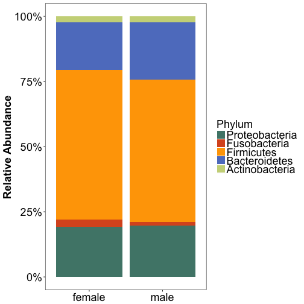
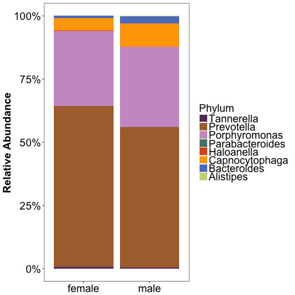
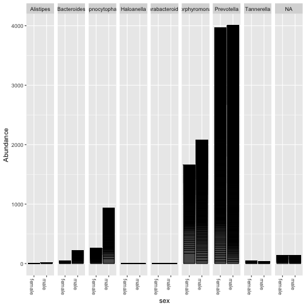
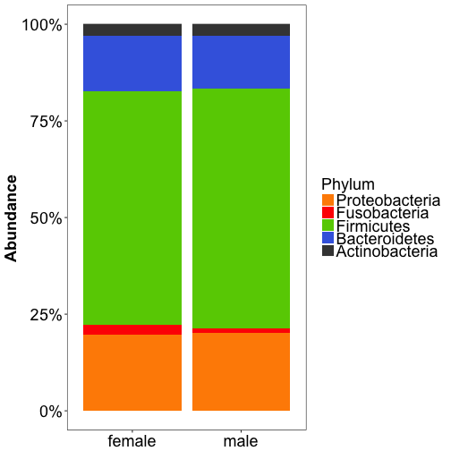
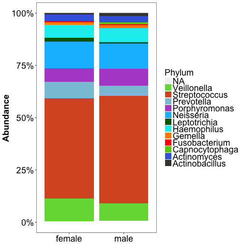
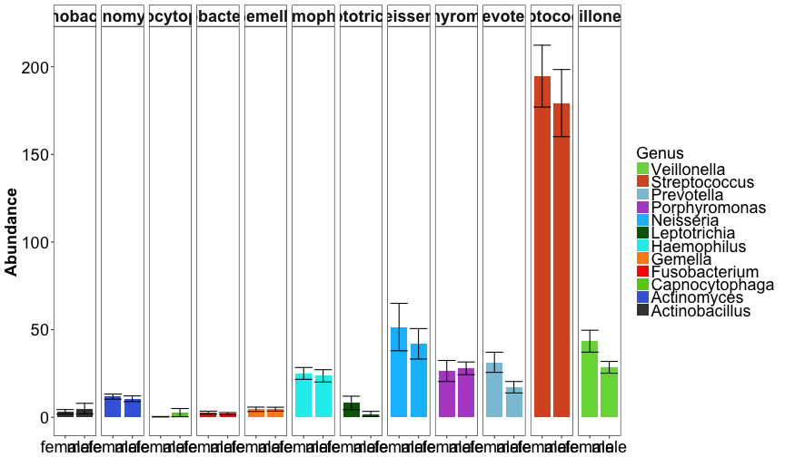

  
  This week's questions and your answers:
  

```r
library(phyloseq)
HMPv35 <- "/Users/sergiomorales/Dropbox/Micro336/Lab info/Week3/HMPv35.RData"
load(HMPv35)
HMPv35Throat = subset_samples(HMPv35, HMPbodysubsite == "Throat")
HMPv35T_JCVI = subset_samples(HMPv35Throat, RUNCENTER == "JCVI")
HMPv35T_JCVI = prune_taxa(taxa_sums(HMPv35T_JCVI) > 1, HMPv35T_JCVI)
HMPv35T_JCVI = rarefy_even_depth(HMPv35T_JCVI, 1000)
```

```
## You set `rngseed` to FALSE. Make sure you've set & recorded
##  the random seed of your session for reproducibility.
## See `?set.seed`
```

```
## ...
```

```
## 1 samples removedbecause they contained fewer reads than `sample.size`.
```

```
## Up to first five removed samples are:
```

```
## 700102054	
```

```
## ...
```

```
## 2805OTUs were removed because they are no longer 
## present in any sample after random subsampling
```

```
## ...
```


1. Create a new dataset with only Throat samples sequenced in JCVI. Remember to rarefy (1000 sequences per sample) and trim (absent taxa removed) your dataset from last week. Show a plot with changes in Phyla by sex using only groups representing more than 10% of data of relative abundance.


```r
library(ggplot2)
library(plyr)
library(dplyr)
library(scales)

HMPv35T_JCVI_over1 <- HMPv35T_JCVI %>% ##use this file for analysis 
  tax_glom(taxrank = "Phylum")  %>% ##collapse all data at the phylum level 
  transform_sample_counts(function(x) {x/sum(x)} ) %>% ##convert counts to relative abundance 
  psmelt() %>%      ##melt (convert to a format [data.frame] compatible with ggplots) to long format
  filter(Abundance > 0.1)   %>% ##prune out phyla below 1% in each sample
  arrange(Phylum) ##here we sort phylum data based on abundance

#Now you have your data ready for plotting in ggplots

d= ggplot(HMPv35T_JCVI_over1,aes(x=sex,y=Abundance,fill=Phylum))+ geom_bar(stat="identity",position="fill") +  scale_y_continuous(labels = percent_format()) ##plot data

b= d+ ylab("Relative Abundance") ##add label

a= b+ scale_fill_manual(name="Phylum",values = c("#CBD588", "#5F7FC7", "orange","#DA5724", "#508578", "#CD9BCD", "#AD6F3B", "#673770","#D14285", "#652926", "#C84248", "#8569D5", "#5E738F","#D1A33D", "#8A7C64", "#599861")) ##manually assign colors to the graph.


z= a+ theme(axis.title.x = element_blank(),
            axis.text.x = element_text(angle=0, colour = "black", vjust=1, hjust = 0.5, size=18),
            axis.text.y = element_text(colour = "black", size=18),
            axis.title.y = element_text(face="bold",size=18),
            plot.title = element_text(size = 18),
            legend.title =element_text(size = 18),
            legend.text = element_text(size = 18),
            legend.position="right",
            legend.key.size = unit(0.50, "cm"),
            strip.text.x = element_text(size=18, face="bold"),
            strip.text.y = element_text(size=18, face="bold"),
            panel.background = element_blank(),
            panel.border = element_rect(fill = NA, colour = "black"), 
            strip.background = element_rect(colour="black")) ##manually change attributes of the graph.


y= z+ guides(fill = guide_legend(reverse = TRUE, ncol=1)) ##orient legend and indicate the number of columns for it.

y ##plot the graph
```



2. Identify one phylum which may be affected by sex. Subset your dataset and only plot that phylum.


```r
#Subset by Bacteroidetes
HPR.bact = subset_taxa(HMPv35T_JCVI , Phylum == "Bacteroidetes")

# prune out genera with no hits in each sample and re-use prior code
HPR.bact.RA <- HPR.bact %>%
  tax_glom(taxrank = "Genus")  %>%
  transform_sample_counts(function(x) {x/sum(x)} ) %>%
  psmelt() %>%
  filter(Abundance > 0.00)   %>%
  arrange(Genus)

d= ggplot(HPR.bact.RA,aes(x=sex,y=Abundance,fill=Genus))+ geom_bar(stat="identity",position="fill") +  scale_y_continuous(labels = percent_format()) ##plot data

b= d+ ylab("Relative Abundance") ##add label

a= b+ scale_fill_manual(name="Phylum",values = c("#CBD588", "#5F7FC7", "orange","#DA5724", "#508578", "#CD9BCD", "#AD6F3B", "#673770","#D14285", "#652926", "#C84248", "#8569D5", "#5E738F","#D1A33D", "#8A7C64", "#599861")) ##manually assign colors to the graph.


z= a+ theme(axis.title.x = element_blank(),
            axis.text.x = element_text(angle=0, colour = "black", vjust=1, hjust = 0.5, size=18),
            axis.text.y = element_text(colour = "black", size=18),
            axis.title.y = element_text(face="bold",size=18),
            plot.title = element_text(size = 18),
            legend.title =element_text(size = 18),
            legend.text = element_text(size = 18),
            legend.position="right",
            legend.key.size = unit(0.50, "cm"),
            strip.text.x = element_text(size=18, face="bold"),
            strip.text.y = element_text(size=18, face="bold"),
            panel.background = element_blank(),
            panel.border = element_rect(fill = NA, colour = "black"), 
            strip.background = element_rect(colour="black")) ##manually change attributes of the graph.


y= z+ guides(fill = guide_legend(reverse = TRUE, ncol=1)) ##orient legend and indicate the number of columns for it.

y ##plot the graph
```



3. Re-plot data using absolute abundance and facet plots by Genera


```r
plot_bar(HPR.bact, "sex", facet_grid = .~Genus)
```




4. What is the average dissimilarity between males and females in your dataset?


```r
library(vegan)
HMPv35T_JCVI_df <- data.frame(otu_table(HMPv35T_JCVI))

#transpose data frame
HMPv35T_JCVI_df_t <- t(HMPv35T_JCVI_df)

#Extract sample_data and make a data frame
HMPv35T_JCVI_sd <- data.frame(sample_data(HMPv35T_JCVI))

#Use the variable HMPbodysubsite to perform a SIMPER analysis on your OTU data.frame
(sim <- with(HMPv35T_JCVI_sd, simper(HMPv35T_JCVI_df_t, sex),permutations = 999))
```

```
## cumulative contributions of most influential species:
## 
## $male_female
## OTU_97.43346 OTU_97.45365 OTU_97.44594 OTU_97.40593 OTU_97.45429 
##   0.03199549   0.05781098   0.08294564   0.10649792   0.12320279 
## OTU_97.42864 OTU_97.43147 OTU_97.45366 OTU_97.44941 OTU_97.45246 
##   0.13336971   0.14191092   0.15006633   0.15720360   0.16430477 
## OTU_97.44427 OTU_97.43258 OTU_97.43017 OTU_97.40598 OTU_97.42356 
##   0.17091079   0.17682053   0.18213815   0.18683375   0.19137978 
##    OTU_97.99 OTU_97.44798 OTU_97.43162 OTU_97.40405   OTU_97.117 
##   0.19492108   0.19843556   0.20167874   0.20490232   0.20805370 
## OTU_97.42502 OTU_97.37770 OTU_97.39353  OTU_97.6231 OTU_97.42838 
##   0.21116691   0.21417490   0.21713337   0.22005574   0.22296883 
## OTU_97.43685 OTU_97.44851 OTU_97.42789 OTU_97.39601 OTU_97.41451 
##   0.22587573   0.22875787   0.23158328   0.23436949   0.23695248 
## OTU_97.44846 OTU_97.38530 OTU_97.43072  OTU_97.2109 OTU_97.37856 
##   0.23949215   0.24187605   0.24418466   0.24644374   0.24869870 
## OTU_97.38593  OTU_97.5905 OTU_97.45310 OTU_97.43549 OTU_97.38934 
##   0.25094644   0.25315499   0.25536250   0.25755144   0.25973110 
## OTU_97.42334 OTU_97.40605 OTU_97.43028 OTU_97.42383 OTU_97.38639 
##   0.26190972   0.26406359   0.26617826   0.26828468   0.27038182 
## OTU_97.40529 OTU_97.43057 OTU_97.30676 OTU_97.40005 OTU_97.45328 
##   0.27246657   0.27453482   0.27659689   0.27861150   0.28061579 
## OTU_97.39182 OTU_97.42820 OTU_97.42967 OTU_97.38737 OTU_97.44792 
##   0.28255819   0.28446140   0.28636151   0.28823377   0.29009158 
## OTU_97.45122 OTU_97.32912 OTU_97.39497 OTU_97.42404 OTU_97.42905 
##   0.29194011   0.29374532   0.29553918   0.29730003   0.29905985 
## OTU_97.44581 OTU_97.42432 OTU_97.44463 OTU_97.45141 OTU_97.34134 
##   0.30081038   0.30255576   0.30429598   0.30601866   0.30771968 
## OTU_97.43012 OTU_97.43971 OTU_97.31657 OTU_97.43660 OTU_97.19778 
##   0.30941142   0.31105467   0.31269690   0.31433499   0.31592461 
##  OTU_97.7846 OTU_97.11765 OTU_97.42946 OTU_97.38187 OTU_97.37899 
##   0.31751319   0.31909661   0.32067591   0.32223355   0.32375714 
## OTU_97.44604 OTU_97.44036 OTU_97.44502 OTU_97.21635   OTU_97.236 
##   0.32527351   0.32678473   0.32828666   0.32978756   0.33124411 
## OTU_97.37509 OTU_97.39651 OTU_97.43645 OTU_97.44693 OTU_97.43924 
##   0.33269240   0.33413038   0.33555288   0.33693618   0.33829886 
## OTU_97.39679 OTU_97.44905    OTU_97.36 OTU_97.31782 OTU_97.38005 
##   0.33965224   0.34099738   0.34233839   0.34367425   0.34500185 
##   OTU_97.903 OTU_97.40226 OTU_97.38446 OTU_97.39846 OTU_97.36958 
##   0.34632532   0.34764673   0.34896608   0.35028440   0.35159343 
## OTU_97.42866 OTU_97.42628 OTU_97.43049 OTU_97.25524 OTU_97.44833 
##   0.35289627   0.35419396   0.35548855   0.35677283   0.35805091 
## OTU_97.42422 OTU_97.25709 OTU_97.44550 OTU_97.44518 OTU_97.44958 
##   0.35929496   0.36052044   0.36173147   0.36293735   0.36414117 
##    OTU_97.20 OTU_97.43098 OTU_97.27442 OTU_97.32952 OTU_97.17317 
##   0.36534395   0.36653642   0.36772785   0.36889866   0.37006946 
## OTU_97.10355 OTU_97.40335 OTU_97.41593 OTU_97.31107 OTU_97.43248 
##   0.37122892   0.37238735   0.37353237   0.37467738   0.37581002 
## OTU_97.39678 OTU_97.31234 OTU_97.42237 OTU_97.42973 OTU_97.44423 
##   0.37694163   0.37807324   0.37919762   0.38031376   0.38142783 
## OTU_97.39522 OTU_97.39998 OTU_97.44157 OTU_97.36283 OTU_97.45007 
##   0.38253468   0.38363327   0.38471124   0.38578611   0.38685892 
## OTU_97.20253 OTU_97.41612 OTU_97.36204 OTU_97.38612 OTU_97.42996 
##   0.38792657   0.38899422   0.39005878   0.39111921   0.39217654 
##   OTU_97.213 OTU_97.44532 OTU_97.40308 OTU_97.44953 OTU_97.32788 
##   0.39322047   0.39426336   0.39529388   0.39632027   0.39734047 
## OTU_97.44656 OTU_97.37130 OTU_97.33579 OTU_97.45148 OTU_97.36941 
##   0.39835345   0.39935198   0.40034846   0.40134184   0.40231974 
## OTU_97.39066 OTU_97.41849 OTU_97.42987 OTU_97.45340 OTU_97.45297 
##   0.40329146   0.40426214   0.40522974   0.40618907   0.40714738 
## OTU_97.43593 OTU_97.40720 OTU_97.42824  OTU_97.8873 OTU_97.44592 
##   0.40810156   0.40905162   0.40999961   0.41094347   0.41188528 
## OTU_97.28642 OTU_97.40176 OTU_97.37504 OTU_97.45001 OTU_97.29370 
##   0.41282501   0.41376166   0.41468283   0.41559678   0.41650764 
## OTU_97.42663 OTU_97.45053 OTU_97.15634 OTU_97.40838 OTU_97.42852 
##   0.41740302   0.41829428   0.41917522   0.42005100   0.42092472 
## OTU_97.10732 OTU_97.23667 OTU_97.44485 OTU_97.19157 OTU_97.40329 
##   0.42179122   0.42265153   0.42350874   0.42435255   0.42519429 
## OTU_97.36018 OTU_97.39306 OTU_97.39685    OTU_97.42 OTU_97.42855 
##   0.42603294   0.42686849   0.42770405   0.42853960   0.42937309 
## OTU_97.37936 OTU_97.42878  OTU_97.3876 OTU_97.45434 OTU_97.16522 
##   0.43020658   0.43103800   0.43186427   0.43268848   0.43350546 
## OTU_97.29641 OTU_97.45120 OTU_97.42136 OTU_97.29790 OTU_97.40437 
##   0.43432039   0.43513324   0.43593888   0.43674246   0.43754397 
## OTU_97.42345 OTU_97.44629 OTU_97.39091 OTU_97.36139 OTU_97.36948 
##   0.43834548   0.43913874   0.43993097   0.44072010   0.44150820 
##    OTU_97.62 OTU_97.36154 OTU_97.33966 OTU_97.45337 OTU_97.42194 
##   0.44229321   0.44307719   0.44386013   0.44464204   0.44542086 
## OTU_97.44087 OTU_97.43265 OTU_97.44228 OTU_97.41947 OTU_97.44630 
##   0.44619865   0.44697540   0.44774803   0.44851963   0.44929122 
## OTU_97.43881 OTU_97.43068 OTU_97.42965 OTU_97.32014 OTU_97.14058 
##   0.45005973   0.45082720   0.45159157   0.45235389   0.45311517 
## OTU_97.44564 OTU_97.44856    OTU_97.50 OTU_97.39312 OTU_97.44025 
##   0.45387439   0.45462948   0.45538354   0.45613657   0.45688960 
## OTU_97.22119 OTU_97.30058 OTU_97.39887 OTU_97.22140 OTU_97.36839 
##   0.45763747   0.45837915   0.45911877   0.45985736   0.46059182 
##  OTU_97.9434 OTU_97.18031 OTU_97.35554 OTU_97.42662 OTU_97.45294 
##   0.46131906   0.46204630   0.46276735   0.46348840   0.46420842 
## OTU_97.34541 OTU_97.37448 OTU_97.44188 OTU_97.44522 OTU_97.39645 
##   0.46492741   0.46564330   0.46635817   0.46706581   0.46777035 
## OTU_97.38427   OTU_97.385 OTU_97.42805 OTU_97.42982 OTU_97.38700 
##   0.46847490   0.46917738   0.46987780   0.47056997   0.47126214 
## OTU_97.43910 OTU_97.43000   OTU_97.224 OTU_97.11156 OTU_97.39532 
##   0.47195328   0.47264235   0.47332626   0.47401018   0.47469100 
## OTU_97.44975 OTU_97.29302 OTU_97.37383 OTU_97.25654 OTU_97.34053 
##   0.47536769   0.47604336   0.47671489   0.47738540   0.47805591 
## OTU_97.41974  OTU_97.4822 OTU_97.19102 OTU_97.25690 OTU_97.42525 
##   0.47872435   0.47939073   0.48005504   0.48071833   0.48138161 
## OTU_97.16989 OTU_97.39787 OTU_97.26526 OTU_97.40685 OTU_97.29286 
##   0.48204180   0.48269890   0.48335290   0.48400587   0.48465574 
## OTU_97.37004    OTU_97.53  OTU_97.1704 OTU_97.42997 OTU_97.45311 
##   0.48530252   0.48594002   0.48657751   0.48721295   0.48784013 
## OTU_97.45322 OTU_97.44957 OTU_97.45166 OTU_97.40548 OTU_97.39049 
##   0.48846731   0.48909036   0.48971342   0.49033544   0.49095437 
## OTU_97.42938 OTU_97.44665 OTU_97.42494 OTU_97.43758 OTU_97.37841 
##   0.49157226   0.49219016   0.49280702   0.49342286   0.49403869 
## OTU_97.25956 OTU_97.38845 OTU_97.43676 OTU_97.43982 OTU_97.37867 
##   0.49464834   0.49525592   0.49586247   0.49646386   0.49706422 
##   OTU_97.269 OTU_97.24873   OTU_97.191 OTU_97.43952 OTU_97.30551 
##   0.49766148   0.49825875   0.49885498   0.49945019   0.50004332 
## OTU_97.13420 OTU_97.29384    OTU_97.86 OTU_97.11855 OTU_97.42948 
##   0.50063543   0.50122548   0.50181346   0.50239938   0.50298323 
## OTU_97.17766 OTU_97.42917  OTU_97.2164 OTU_97.31315    OTU_97.40 
##   0.50356193   0.50414063   0.50471623   0.50529183   0.50586434 
## OTU_97.44713  OTU_97.3695 OTU_97.42406 OTU_97.45128 OTU_97.42986 
##   0.50643582   0.50700627   0.50757671   0.50814716   0.50871038 
## OTU_97.25816 OTU_97.39153 OTU_97.36799 OTU_97.44507  OTU_97.5555 
##   0.50927154   0.50982858   0.51038458   0.51094058   0.51149453 
## OTU_97.45398 OTU_97.44431 OTU_97.14804 OTU_97.37929   OTU_97.199 
##   0.51204847   0.51260241   0.51315222   0.51370100   0.51424772 
## OTU_97.14939   OTU_97.237 OTU_97.43178 OTU_97.27554 OTU_97.43445 
##   0.51479444   0.51534116   0.51588685   0.51643048   0.51697204 
## OTU_97.44059 OTU_97.42393 OTU_97.43880 OTU_97.43010 OTU_97.35992 
##   0.51751154   0.51805104   0.51859054   0.51912900   0.51966541 
## OTU_97.18619 OTU_97.19813 OTU_97.23317 OTU_97.37259 OTU_97.39106 
##   0.52020078   0.52073615   0.52126843   0.52180071   0.52233196 
## OTU_97.39423    OTU_97.16 OTU_97.33208 OTU_97.31207 OTU_97.45233 
##   0.52286320   0.52339239   0.52391951   0.52444456   0.52496962 
## OTU_97.15961 OTU_97.42210 OTU_97.36217  OTU_97.7820 OTU_97.45223 
##   0.52549365   0.52601458   0.52653138   0.52704819   0.52756293 
## OTU_97.43686 OTU_97.42924 OTU_97.40718 OTU_97.39245 OTU_97.44523 
##   0.52807561   0.52858622   0.52909581   0.52960333   0.53010982 
## OTU_97.45253 OTU_97.31222   OTU_97.813 OTU_97.19971 OTU_97.39262 
##   0.53061528   0.53111764   0.53161897   0.53211824   0.53261235 
## OTU_97.34438 OTU_97.17888 OTU_97.27797  OTU_97.6244 OTU_97.11744 
##   0.53310646   0.53360057   0.53409365   0.53458467   0.53507465 
## OTU_97.45413 OTU_97.31271 OTU_97.38969 OTU_97.29042 OTU_97.38133 
##   0.53556464   0.53605359   0.53654048   0.53702634   0.53751117 
## OTU_97.40667 OTU_97.30800 OTU_97.37682  OTU_97.8528 OTU_97.31742 
##   0.53799599   0.53848082   0.53896462   0.53944738   0.53992911 
## OTU_97.43400 OTU_97.45425 OTU_97.28416 OTU_97.37402 OTU_97.33960 
##   0.54040981   0.54089051   0.54136915   0.54184676   0.54232127 
##  OTU_97.1791 OTU_97.40104 OTU_97.44478  OTU_97.1671 OTU_97.45326 
##   0.54279578   0.54327029   0.54374274   0.54421416   0.54468145 
##   OTU_97.274 OTU_97.40922 OTU_97.41846 OTU_97.44678 OTU_97.11365 
##   0.54514668   0.54561087   0.54607507   0.54653720   0.54699624 
## OTU_97.38352 OTU_97.44048 OTU_97.15280 OTU_97.31118 OTU_97.42589 
##   0.54745425   0.54789884   0.54834241   0.54878597   0.54922747 
## OTU_97.45114   OTU_97.222 OTU_97.44117 OTU_97.45188 OTU_97.45441 
##   0.54966691   0.55010016   0.55053238   0.55096357   0.55139475 
## OTU_97.40575 OTU_97.10201 OTU_97.32451 OTU_97.42626 OTU_97.32002 
##   0.55182594   0.55225403   0.55267697   0.55309990   0.55352284 
## OTU_97.34692 OTU_97.43205 OTU_97.37104 OTU_97.33436 OTU_97.41500 
##   0.55394474   0.55436664   0.55478751   0.55520838   0.55562616 
## OTU_97.26921 OTU_97.44475    OTU_97.55 OTU_97.16819 OTU_97.35551 
##   0.55604394   0.55645965   0.55687227   0.55728282   0.55769338 
## OTU_97.14878 OTU_97.23576 OTU_97.39219 OTU_97.41649 OTU_97.45423 
##   0.55810393   0.55851346   0.55892298   0.55933148   0.55973894 
## OTU_97.40468 OTU_97.16993   OTU_97.271 OTU_97.20121 OTU_97.19424 
##   0.56014640   0.56055283   0.56095926   0.56136569   0.56177005 
## OTU_97.42543   OTU_97.335 OTU_97.39014  OTU_97.7921 OTU_97.39565 
##   0.56217442   0.56257775   0.56298109   0.56338442   0.56378673 
##   OTU_97.590 OTU_97.37533 OTU_97.40760 OTU_97.10943 OTU_97.37085 
##   0.56418903   0.56459030   0.56499157   0.56539181   0.56578999 
## OTU_97.25603 OTU_97.44868 OTU_97.24424 OTU_97.42275 OTU_97.43092 
##   0.56618817   0.56658531   0.56698143   0.56737754   0.56777365 
## OTU_97.34582 OTU_97.42925 OTU_97.45414 OTU_97.39925 OTU_97.44380 
##   0.56816874   0.56856279   0.56895684   0.56934883   0.56973978 
## OTU_97.26646 OTU_97.45445 OTU_97.41805  OTU_97.8060 OTU_97.45011 
##   0.57012971   0.57051757   0.57090440   0.57129020   0.57167496 
## OTU_97.31370 OTU_97.44418 OTU_97.22420 OTU_97.25963   OTU_97.429 
##   0.57205870   0.57244243   0.57282514   0.57320681   0.57358848 
## OTU_97.34144 OTU_97.37299  OTU_97.4785 OTU_97.45134 OTU_97.43542 
##   0.57396809   0.57434667   0.57472422   0.57510073   0.57547621 
## OTU_97.45028 OTU_97.11249    OTU_97.82 OTU_97.40715 OTU_97.43628 
##   0.57585170   0.57622615   0.57660060   0.57697505   0.57734950 
##  OTU_97.5033 OTU_97.45036 OTU_97.33688 OTU_97.26142  OTU_97.9066 
##   0.57772292   0.57809634   0.57846873   0.57884009   0.57920938 
##  OTU_97.2800 OTU_97.34260 OTU_97.39950 OTU_97.33021 OTU_97.39042 
##   0.57957764   0.57994487   0.58031107   0.58067727   0.58104347 
## OTU_97.37843 OTU_97.38864 OTU_97.13037 OTU_97.23956 OTU_97.45109 
##   0.58140864   0.58177381   0.58213794   0.58250105   0.58286415 
## OTU_97.45143  OTU_97.3594 OTU_97.18767 OTU_97.39825 OTU_97.41058 
##   0.58322622   0.58358830   0.58395037   0.58431038   0.58467039 
## OTU_97.27900 OTU_97.37100 OTU_97.44881 OTU_97.37668 OTU_97.44315 
##   0.58502937   0.58538835   0.58574732   0.58610527   0.58646322 
## OTU_97.44301 OTU_97.39489 OTU_97.45210    OTU_97.49 OTU_97.26714 
##   0.58682013   0.58717602   0.58753087   0.58788469   0.58823748 
## OTU_97.45443 OTU_97.45316 OTU_97.44910 OTU_97.44089 OTU_97.40560 
##   0.58859027   0.58894203   0.58929172   0.58964141   0.58999008 
##  OTU_97.7396 OTU_97.44497 OTU_97.37776 OTU_97.39597   OTU_97.176 
##   0.59033874   0.59068740   0.59103606   0.59138370   0.59173133 
## OTU_97.42930   OTU_97.210    OTU_97.88  OTU_97.3221 OTU_97.44660 
##   0.59207896   0.59242556   0.59277216   0.59311876   0.59346433 
## OTU_97.32570 OTU_97.36539 OTU_97.11018   OTU_97.739 OTU_97.44786 
##   0.59380886   0.59415340   0.59449794   0.59484247   0.59518598 
## OTU_97.42844 OTU_97.38731 OTU_97.43358  OTU_97.6088    OTU_97.92 
##   0.59552948   0.59587196   0.59621443   0.59655690   0.59689835 
##  OTU_97.6522 OTU_97.38309 OTU_97.30479  OTU_97.1321 OTU_97.44944 
##   0.59723979   0.59758123   0.59792164   0.59826205   0.59860246 
## OTU_97.11656 OTU_97.45345 OTU_97.43883    OTU_97.97 OTU_97.11650 
##   0.59894184   0.59928122   0.59961957   0.59995791   0.60029626 
## OTU_97.45358 OTU_97.39584 OTU_97.43621 OTU_97.41566  OTU_97.4968 
##   0.60063358   0.60096780   0.60130202   0.60163418   0.60196530 
## OTU_97.42921 OTU_97.37743    OTU_97.59 OTU_97.42278  OTU_97.2113 
##   0.60229540   0.60262240   0.60294837   0.60327434   0.60360030 
## OTU_97.42207   OTU_97.557 OTU_97.42029 OTU_97.33295 OTU_97.29524 
##   0.60392421   0.60424605   0.60456790   0.60488974   0.60521055 
## OTU_97.24836 OTU_97.38034 OTU_97.43207 OTU_97.43145 OTU_97.44820 
##   0.60552930   0.60584598   0.60616164   0.60647729   0.60679294 
## OTU_97.28081 OTU_97.11911 OTU_97.31652 OTU_97.11510 OTU_97.35161 
##   0.60710860   0.60742425   0.60773887   0.60805349   0.60836811 
## OTU_97.30180 OTU_97.45107 OTU_97.45257 OTU_97.27575 OTU_97.44997 
##   0.60868170   0.60899529   0.60930888   0.60962144   0.60993400 
## OTU_97.38210 OTU_97.37463 OTU_97.36451 OTU_97.38056 OTU_97.42688 
##   0.61024553   0.61055706   0.61086858   0.61118011   0.61149061 
## OTU_97.44134 OTU_97.38996 OTU_97.37443 OTU_97.34918 OTU_97.33749 
##   0.61180007   0.61210953   0.61241900   0.61272846   0.61303793 
## OTU_97.21660  OTU_97.6559 OTU_97.31802 OTU_97.10384 OTU_97.34954 
##   0.61334636   0.61365479   0.61396322   0.61427166   0.61457906 
## OTU_97.45030 OTU_97.10497 OTU_97.14002 OTU_97.38092 OTU_97.26542 
##   0.61488646   0.61519283   0.61549816   0.61580247   0.61610575 
## OTU_97.35638 OTU_97.44375 OTU_97.35945 OTU_97.41955 OTU_97.44591 
##   0.61640902   0.61671230   0.61701351   0.61731472   0.61761593 
## OTU_97.38586 OTU_97.31658 OTU_97.10499 OTU_97.44935  OTU_97.1982 
##   0.61791611   0.61821629   0.61851647   0.61881562   0.61911374 
## OTU_97.22563 OTU_97.11800  OTU_97.4736 OTU_97.42405 OTU_97.40571 
##   0.61941185   0.61970997   0.62000706   0.62030414   0.62060020 
## OTU_97.42615 OTU_97.23953 OTU_97.31218 OTU_97.35534 OTU_97.31818 
##   0.62089625   0.62119127   0.62148629   0.62178132   0.62207634 
## OTU_97.33829 OTU_97.42236 OTU_97.39904 OTU_97.44470 OTU_97.32099 
##   0.62237033   0.62266432   0.62295831   0.62325230   0.62354526 
## OTU_97.45195 OTU_97.39356 OTU_97.18979 OTU_97.18715 OTU_97.32303 
##   0.62383822   0.62412912   0.62442001   0.62470885   0.62499768 
##  OTU_97.2284  OTU_97.3666  OTU_97.1416 OTU_97.35824 OTU_97.45373 
##   0.62528548   0.62557328   0.62586108   0.62614889   0.62643669 
## OTU_97.43201    OTU_97.54 OTU_97.37954  OTU_97.6751 OTU_97.17839 
##   0.62672243   0.62700816   0.62729390   0.62757964   0.62786538 
## OTU_97.43380 OTU_97.39579 OTU_97.26545 OTU_97.44299 OTU_97.44911 
##   0.62815009   0.62843273   0.62871537   0.62899802   0.62928066 
## OTU_97.36838 OTU_97.39801 OTU_97.39160 OTU_97.33672 OTU_97.40139 
##   0.62956227   0.62984389   0.63012550   0.63040608   0.63068666 
## OTU_97.38790 OTU_97.36661 OTU_97.32773 OTU_97.24832  OTU_97.1189 
##   0.63096724   0.63124782   0.63152840   0.63180898   0.63208853 
## OTU_97.31418 OTU_97.34681 OTU_97.38536  OTU_97.9599   OTU_97.362 
##   0.63236705   0.63264557   0.63292305   0.63319951   0.63347596 
## OTU_97.33958  OTU_97.1234 OTU_97.19241 OTU_97.42952 OTU_97.44654 
##   0.63375242   0.63402887   0.63430533   0.63458178   0.63485720 
## OTU_97.29005 OTU_97.40500 OTU_97.13386 OTU_97.40968 OTU_97.14340 
##   0.63513263   0.63540805   0.63568347   0.63595889   0.63623329 
## OTU_97.45058 OTU_97.12297 OTU_97.43007 OTU_97.42520 OTU_97.42945 
##   0.63650768   0.63678001   0.63705233   0.63732363   0.63759493 
## OTU_97.34950  OTU_97.3193 OTU_97.36919 OTU_97.37317 OTU_97.33310 
##   0.63786622   0.63813752   0.63840779   0.63867702   0.63894625 
## OTU_97.39022 OTU_97.43095 OTU_97.43979 OTU_97.33810 OTU_97.21560 
##   0.63921446   0.63948266   0.63974983   0.64001700   0.64028314 
## OTU_97.37966 OTU_97.21206 OTU_97.38419 OTU_97.37082 OTU_97.45103 
##   0.64054825   0.64081335   0.64107846   0.64134254   0.64160661 
## OTU_97.42564 OTU_97.18539 OTU_97.44943 OTU_97.34755 OTU_97.40331 
##   0.64187069   0.64213373   0.64239678   0.64265982   0.64292287 
## OTU_97.42342 OTU_97.45161 OTU_97.41394 OTU_97.40125 OTU_97.25486 
##   0.64318488   0.64344586   0.64370684   0.64396782   0.64422777 
## OTU_97.15665 OTU_97.32830 OTU_97.43238  OTU_97.8168 OTU_97.27068 
##   0.64448772   0.64474664   0.64500453   0.64526242   0.64552030 
## OTU_97.45362 OTU_97.45321 OTU_97.40792  OTU_97.2478 OTU_97.44406 
##   0.64577716   0.64603401   0.64628984   0.64654566   0.64680148 
## OTU_97.38894 OTU_97.18626 OTU_97.44267 OTU_97.16273 OTU_97.26504 
##   0.64705628   0.64731107   0.64756586   0.64781962   0.64807338 
## OTU_97.41900 OTU_97.45428  OTU_97.8655 OTU_97.42658 OTU_97.19680 
##   0.64832714   0.64857987   0.64883260   0.64908533   0.64933702 
## OTU_97.39211 OTU_97.33876  OTU_97.1884 OTU_97.40695 OTU_97.33855 
##   0.64958769   0.64983836   0.65008902   0.65033969   0.65059035 
## OTU_97.37869 OTU_97.39346 OTU_97.41449 OTU_97.45087 OTU_97.42870 
##   0.65084102   0.65109065   0.65134029   0.65158992   0.65183956 
##   OTU_97.157 OTU_97.28494 OTU_97.40182 OTU_97.42374 OTU_97.34346 
##   0.65208816   0.65233573   0.65258330   0.65282984   0.65307535 
## OTU_97.30129   OTU_97.145  OTU_97.7324 OTU_97.38106 OTU_97.39491 
##   0.65332086   0.65356534   0.65380981   0.65405429   0.65429773 
## OTU_97.24495 OTU_97.42854 OTU_97.42113  OTU_97.1101 OTU_97.45213 
##   0.65454118   0.65478462   0.65502807   0.65527048   0.65551290 
## OTU_97.44434 OTU_97.43519  OTU_97.6102   OTU_97.281 OTU_97.39982 
##   0.65575531   0.65599772   0.65623910   0.65648049   0.65672187 
## OTU_97.44452 OTU_97.43386 OTU_97.39112 OTU_97.38631 OTU_97.18577 
##   0.65696325   0.65720463   0.65744601   0.65768636   0.65792671 
## OTU_97.37777 OTU_97.24916  OTU_97.1398   OTU_97.292 OTU_97.40986 
##   0.65816707   0.65840638   0.65864570   0.65888502   0.65912434 
## OTU_97.11486 OTU_97.45320 OTU_97.40615 OTU_97.15214 OTU_97.34426 
##   0.65936366   0.65960298   0.65984127   0.66007955   0.66031681 
## OTU_97.35171 OTU_97.35408 OTU_97.44886 OTU_97.37951 OTU_97.19801 
##   0.66055406   0.66079132   0.66102858   0.66126377   0.66149896 
## OTU_97.41980 OTU_97.12408 OTU_97.23586 OTU_97.35210 OTU_97.42949 
##   0.66173415   0.66196935   0.66220351   0.66243767   0.66267183 
## OTU_97.28892 OTU_97.27077  OTU_97.2602 OTU_97.29568    OTU_97.23 
##   0.66290496   0.66313809   0.66337122   0.66360435   0.66383748 
## OTU_97.35840 OTU_97.42542 OTU_97.35207 OTU_97.43214 OTU_97.37827 
##   0.66406958   0.66430167   0.66453274   0.66476381   0.66499487 
## OTU_97.41372 OTU_97.34383 OTU_97.32416  OTU_97.8819 OTU_97.40535 
##   0.66522594   0.66545701   0.66568704   0.66591604   0.66614505 
## OTU_97.44699  OTU_97.1693 OTU_97.36478 OTU_97.38375 OTU_97.15362 
##   0.66637405   0.66660202   0.66682999   0.66705797   0.66728594 
## OTU_97.40952   OTU_97.321 OTU_97.24009 OTU_97.21248 OTU_97.44093 
##   0.66751391   0.66774188   0.66796985   0.66819783   0.66842580 
## OTU_97.37734 OTU_97.42482    OTU_97.60  OTU_97.6351 OTU_97.37637 
##   0.66865377   0.66888071   0.66910765   0.66933459   0.66956153 
## OTU_97.45196 OTU_97.41993 OTU_97.38044 OTU_97.43137  OTU_97.3388 
##   0.66978847   0.67001541   0.67024235   0.67046723   0.67069211 
## OTU_97.22575 OTU_97.35854 OTU_97.43120 OTU_97.44116 OTU_97.37491 
##   0.67091698   0.67114186   0.67136674   0.67159161   0.67181546 
## OTU_97.17703 OTU_97.44565 OTU_97.42895 OTU_97.31738   OTU_97.382 
##   0.67203931   0.67226315   0.67248700   0.67270981   0.67293263 
##  OTU_97.4225 OTU_97.36278 OTU_97.32720 OTU_97.16683 OTU_97.29062 
##   0.67315544   0.67337825   0.67360107   0.67382388   0.67404566 
## OTU_97.38055 OTU_97.39085   OTU_97.330 OTU_97.44101 OTU_97.35552 
##   0.67426642   0.67448717   0.67470792   0.67492867   0.67514942 
## OTU_97.43093 OTU_97.41568 OTU_97.42582 OTU_97.41005 OTU_97.43562 
##   0.67537017   0.67559092   0.67581167   0.67603242   0.67625214 
## OTU_97.15299 OTU_97.44631 OTU_97.30700  OTU_97.1736 OTU_97.43673 
##   0.67647186   0.67669158   0.67691130   0.67713102   0.67734971 
##    OTU_97.66 OTU_97.25370 OTU_97.19335 OTU_97.15508  OTU_97.2947 
##   0.67756840   0.67778708   0.67800474   0.67822240   0.67844005 
##  OTU_97.2307 OTU_97.29049 OTU_97.45334 OTU_97.24587 OTU_97.45267 
##   0.67865771   0.67887537   0.67909302   0.67931068   0.67952834 
##  OTU_97.1054 OTU_97.37369  OTU_97.1462 OTU_97.35328 OTU_97.12964 
##   0.67974496   0.67996159   0.68017821   0.68039483   0.68061043 
## OTU_97.42450 OTU_97.26118 OTU_97.33388 OTU_97.33707 OTU_97.43301 
##   0.68082602   0.68104161   0.68125618   0.68147074   0.68168530 
## OTU_97.33292 OTU_97.31127 OTU_97.15809 OTU_97.45050 OTU_97.29910 
##   0.68189986   0.68211339   0.68232692   0.68254045   0.68275398 
## OTU_97.40758 OTU_97.38129 OTU_97.37721  OTU_97.7999  OTU_97.1705 
##   0.68296751   0.68318001   0.68339251   0.68360501   0.68381751 
## OTU_97.34791 OTU_97.39414 OTU_97.32392 OTU_97.32175 OTU_97.21390 
##   0.68403001   0.68424250   0.68445397   0.68466544   0.68487691 
## OTU_97.35130 OTU_97.30904 OTU_97.44171 OTU_97.37972 OTU_97.43115 
##   0.68508837   0.68529881   0.68550924   0.68571968   0.68593011 
##  OTU_97.1188 OTU_97.34180  OTU_97.5774 OTU_97.35204 OTU_97.44826 
##   0.68614055   0.68635099   0.68656142   0.68677186   0.68698229 
## OTU_97.37013 OTU_97.11084   OTU_97.209 OTU_97.11508 OTU_97.31912 
##   0.68719170   0.68740110   0.68761050   0.68781991   0.68802828 
##   OTU_97.127 OTU_97.45298 OTU_97.24965  OTU_97.5157 OTU_97.34538 
##   0.68823665   0.68844503   0.68865340   0.68886177   0.68907014 
## OTU_97.40191 OTU_97.43518 OTU_97.13039 OTU_97.36157 OTU_97.40962 
##   0.68927748   0.68948482   0.68969217   0.68989951   0.69010685 
##  OTU_97.7371 OTU_97.40163 OTU_97.29468 OTU_97.42989 OTU_97.41499 
##   0.69031419   0.69052050   0.69072681   0.69093312   0.69113943 
## OTU_97.26747 OTU_97.36105 OTU_97.43343 OTU_97.40699  OTU_97.9856 
##   0.69134470   0.69154998   0.69175526   0.69196054   0.69216478 
## OTU_97.34977  OTU_97.7260   OTU_97.591 OTU_97.41956  OTU_97.7675 
##   0.69236903   0.69257328   0.69277752   0.69298177   0.69318498 
## OTU_97.21154 OTU_97.10964   OTU_97.416 OTU_97.40671 OTU_97.37298 
##   0.69338820   0.69359038   0.69379256   0.69399475   0.69419693 
## OTU_97.32484 OTU_97.39065 OTU_97.36887 OTU_97.30301 OTU_97.35727 
##   0.69439911   0.69460027   0.69480039   0.69500051   0.69520063 
##     OTU_97.6 OTU_97.45250 OTU_97.40712 OTU_97.15416 OTU_97.35457 
##   0.69540075   0.69560087   0.69579995   0.69599904   0.69619813 
## OTU_97.38999 OTU_97.40570 OTU_97.40312 OTU_97.28541  OTU_97.5917 
##   0.69639722   0.69659528   0.69679333   0.69699139   0.69718842 
## OTU_97.31488 OTU_97.40022 OTU_97.30428 OTU_97.43876   OTU_97.413 
##   0.69738544   0.69758247   0.69777949   0.69797549   0.69817148 
## OTU_97.42084 OTU_97.24658 OTU_97.44081 OTU_97.45113 OTU_97.35021 
##   0.69836644   0.69856140   0.69875534   0.69894927   0.69914320 
## OTU_97.38537 OTU_97.24504 OTU_97.15062 OTU_97.37764   OTU_97.153 
##   0.69933610   0.69952900   0.69972189   0.69991479   0.70010769
```

```r
#Create a summary and save as results
result <- summary(sim) 

#export data to txt file
simper <- result$"male_female"
write.table(simper, "/Users/sergiomorales/Downloads/simper_T_JCVI.txt", sep="\t")
lapply(sim, FUN = function(x){x$overall})
```

```
## $male_female
## [1] 0.7920082
```


2. How many OTUs make up the top 15% of the variance in the generated SIMPER file?


3. Provide a plot showing the Phyla represented by organisms identified in SIMPER analysis contributing the top 30% of the variance.


```r
#Rename OTU ID and add to tax_table
tax_table(HMPv35T_JCVI) <- cbind(tax_table(HMPv35T_JCVI), OTU=taxa_names(HMPv35T_JCVI))

#Subset SIMPER results and only keep OTUs contributing to the top 30% of variance
simper_30 <- subset(simper, cumsum < 0.30) 

#Make results into data frame
simper_30 <- data.frame(OTU = rownames(simper_30), simper_30)

#Make a new file with only the names of the OTUs you wish to keep.
keepTaxa_30 <- simper_30$OTU

#Check that your names are OK.
print(keepTaxa_30)
```

```
##  [1] OTU_97.43346 OTU_97.45365 OTU_97.44594 OTU_97.40593 OTU_97.45429
##  [6] OTU_97.42864 OTU_97.43147 OTU_97.45366 OTU_97.44941 OTU_97.45246
## [11] OTU_97.44427 OTU_97.43258 OTU_97.43017 OTU_97.40598 OTU_97.42356
## [16] OTU_97.99    OTU_97.44798 OTU_97.43162 OTU_97.40405 OTU_97.117  
## [21] OTU_97.42502 OTU_97.37770 OTU_97.39353 OTU_97.6231  OTU_97.42838
## [26] OTU_97.43685 OTU_97.44851 OTU_97.42789 OTU_97.39601 OTU_97.41451
## [31] OTU_97.44846 OTU_97.38530 OTU_97.43072 OTU_97.2109  OTU_97.37856
## [36] OTU_97.38593 OTU_97.5905  OTU_97.45310 OTU_97.43549 OTU_97.38934
## [41] OTU_97.42334 OTU_97.40605 OTU_97.43028 OTU_97.42383 OTU_97.38639
## [46] OTU_97.40529 OTU_97.43057 OTU_97.30676 OTU_97.40005 OTU_97.45328
## [51] OTU_97.39182 OTU_97.42820 OTU_97.42967 OTU_97.38737 OTU_97.44792
## [56] OTU_97.45122 OTU_97.32912 OTU_97.39497 OTU_97.42404 OTU_97.42905
## 60 Levels: OTU_97.117 OTU_97.2109 OTU_97.30676 ... OTU_97.99
```

```r
#Use the subset_taxa function and your new taxa list to create a phyloseq file with only your OTUs of interest
SIMPERtop30 <- subset_taxa(HMPv35T_JCVI, OTU %in% keepTaxa_30)

#Melt phyloseq file into a data frame
dat_SIMPERtop30 <- psmelt(SIMPERtop30)
```

```
## Warning in psmelt(SIMPERtop30): The rank names: 
## OTU
##  have been renamed to: 
## taxa_OTU
## to avoid conflicts with special phyloseq plot attribute names.
```

```r
#Order data based on Phylum abundance
dat_SIMPERtop30 <- dat_SIMPERtop30[order(dat_SIMPERtop30$Phylum),]

d= ggplot(dat_SIMPERtop30, aes(x = sex, y = Abundance, fill = Phylum))+ geom_bar(stat="identity",position="fill") +  scale_y_continuous(labels = percent_format())

c= d+ xlab("Sex")

b= c+ ylab("Abundance")

a= b+ scale_fill_manual(name="Phylum",values = c("grey26", "royalblue", "chartreuse3",  "red", "darkorange","cyan2", "darkgreen", "deepskyblue", "mediumorchid3","#89C5DA", "#DA5724", "#74D944", "#C84248", "#673770", "#D3D93E", "#38333E", "#508578", "#D7C1B1", "#689030",   "#AD6F3B", "#CD9BCD", "#D14285", "#6DDE88", "#652926", "#7FDCC0", "#8569D5", "#5E738F", "#D1A33D", "#8A7C64", "#599861", "blue4", "yellow1", "violetred", "#990000", "#99CC00", "#003300", "#00CCCC", "#9966CC", "#993366", "#990033", "#4863A0", "#000033", "#330000", "#00CC99", "#00FF33", "#00CCFF", "#FF9933", "#660066", "#FF0066", "#330000", "#CCCCFF", "#3399FF", "#66FFFF", "#B5EAAA","#FFE87C"))

z= a+ theme(axis.title.x = element_blank(),
            axis.text.x = element_text(angle=0, colour = "black", vjust=1, hjust = 0.5, size=18),
            axis.text.y = element_text(colour = "black", size=18),
            axis.title.y = element_text(face="bold",size=18),
            plot.title = element_text(size = 18),
            legend.title =element_text(size = 18),
            legend.text = element_text(size = 18),
            legend.position="right",
            legend.key.size = unit(0.50, "cm"),
            strip.text.x = element_text(size=18, face="bold"),
            strip.text.y = element_text(size=18, face="bold"),
            panel.background = element_blank(),
            panel.border = element_rect(fill = NA, colour = "black"),
            strip.background = element_rect(colour="black"))

y= z+ guides(fill = guide_legend(reverse = TRUE, ncol=1))
y
```



4. Provide a plot showing the Genera represented by organisms identified in SIMPER analysis contributing the top 30% of the variance. 


```r
d= ggplot(dat_SIMPERtop30, aes(x = sex, y = Abundance, fill = Genus))+ geom_bar(stat="identity",position="fill") +  scale_y_continuous(labels = percent_format())

c= d+ xlab("Sex")

b= c+ ylab("Abundance")

a= b+ scale_fill_manual(name="Phylum",values = c("grey26", "royalblue", "chartreuse3",  "red", "darkorange","cyan2", "darkgreen", "deepskyblue", "mediumorchid3","#89C5DA", "#DA5724", "#74D944", "#C84248", "#673770", "#D3D93E", "#38333E", "#508578", "#D7C1B1", "#689030",   "#AD6F3B", "#CD9BCD", "#D14285", "#6DDE88", "#652926", "#7FDCC0", "#8569D5", "#5E738F", "#D1A33D", "#8A7C64", "#599861", "blue4", "yellow1", "violetred", "#990000", "#99CC00", "#003300", "#00CCCC", "#9966CC", "#993366", "#990033", "#4863A0", "#000033", "#330000", "#00CC99", "#00FF33", "#00CCFF", "#FF9933", "#660066", "#FF0066", "#330000", "#CCCCFF", "#3399FF", "#66FFFF", "#B5EAAA","#FFE87C"))

z= a+ theme(axis.title.x = element_blank(),
            axis.text.x = element_text(angle=0, colour = "black", vjust=1, hjust = 0.5, size=18),
            axis.text.y = element_text(colour = "black", size=18),
            axis.title.y = element_text(face="bold",size=18),
            plot.title = element_text(size = 18),
            legend.title =element_text(size = 18),
            legend.text = element_text(size = 18),
            legend.position="right",
            legend.key.size = unit(0.50, "cm"),
            strip.text.x = element_text(size=18, face="bold"),
            strip.text.y = element_text(size=18, face="bold"),
            panel.background = element_blank(),
            panel.border = element_rect(fill = NA, colour = "black"),
            strip.background = element_rect(colour="black"))

y= z+ guides(fill = guide_legend(reverse = TRUE, ncol=1))
y
```




5. Provide a facetted plot by genus with error bars for Genera identified in SIMPER analysis.


```r
SIMPERtop30gen_glom <- tax_glom(SIMPERtop30, taxrank = 'Genus')

#Melt phyloseq file into a data frame
dat_SIMPERtop30gen_glom <- psmelt(SIMPERtop30gen_glom)
```

```
## Warning in psmelt(SIMPERtop30gen_glom): The rank names: 
## OTU
##  have been renamed to: 
## taxa_OTU
## to avoid conflicts with special phyloseq plot attribute names.
```

```r
#Order data based on Phylum abundance
dat_SIMPERtop30gen_glom <- dat_SIMPERtop30gen_glom[order(dat_SIMPERtop30gen_glom$Phylum),]


library(Rmisc)

#summarize ‘Abundance’ data by clustering samples based on the following variables: "sex", "Phylum", "Class", "Family", "Genus".
sse <- summarySE(dat_SIMPERtop30gen_glom, measurevar="Abundance", groupvars=c("sex", "Phylum", "Class", "Family", "Genus"))

pd <- position_dodge(0.1) # move dots .01 to the left and right to avoid overlap
d = ggplot(sse, aes(x = sex, y = Abundance, fill = sort(Genus))) + facet_grid(~Genus) + geom_bar(stat = "identity", width = 0.85) + theme_bw() + theme(legend.position = "right", strip.background = element_blank(), panel.grid.major = element_blank(),panel.grid.minor = element_blank(),panel.background = element_blank())
c= d+ xlab("Sex") + geom_errorbar(aes(ymin=Abundance-se, ymax=Abundance+se), colour="black", position=pd)
b= c+ ylab("Abundance")
a= b+ scale_fill_manual(name="Genus",values = c("grey26", "royalblue", "chartreuse3",  "red", "darkorange","cyan2", "darkgreen", "deepskyblue", "mediumorchid3","#89C5DA", "#DA5724", "#74D944", "#C84248", "#673770", "#D3D93E", "#38333E", "#508578", "#D7C1B1", "#689030",   "#AD6F3B", "#CD9BCD", "#D14285", "#6DDE88", "#652926", "#7FDCC0", "#8569D5", "#5E738F", "#D1A33D", "#8A7C64", "#599861", "blue4", "yellow1", "violetred", "#990000", "#99CC00", "#003300", "#00CCCC", "#9966CC", "#993366", "#990033", "#4863A0", "#000033", "#330000", "#00CC99", "#00FF33", "#00CCFF", "#FF9933", "#660066", "#FF0066", "#330000", "#CCCCFF", "#3399FF", "#66FFFF", "#B5EAAA","#FFE87C"))
z= a+ theme(axis.title.x = element_blank(),axis.text.x = element_text(angle=0, colour = "black", vjust=1, hjust = 0.5, size=18), axis.text.y = element_text(colour = "black", size=18), axis.title.y = element_text(face="bold",size=18),plot.title = element_text(size = 18), legend.title =element_text(size = 18), legend.text = element_text(size = 18), legend.position="right", legend.key.size = unit(0.50, "cm"),            strip.text.x = element_text(size=18, face="bold"), strip.text.y = element_text(size=18, face="bold"), panel.background = element_blank(), panel.border = element_rect(fill = NA, colour = "black"), strip.background = element_rect(colour="black"))

y= z+ guides(fill = guide_legend(reverse = TRUE, ncol=1))
y
```



6. Which genera seem to show distinct abundances due to sex?

7.	How would you confirm if this was true?


##library(knitr)
##knit('/Users/sergiomorales/Dropbox/Micro336/Lab info/Lab4_notebook_w_code.rmd')
###will make an output file called file.rm
##library(rmarkdown)
##render('/Users/sergiomorales/Dropbox/Micro336/Lab info/Lab4_notebook_w_code.md',"html_document")
